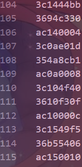
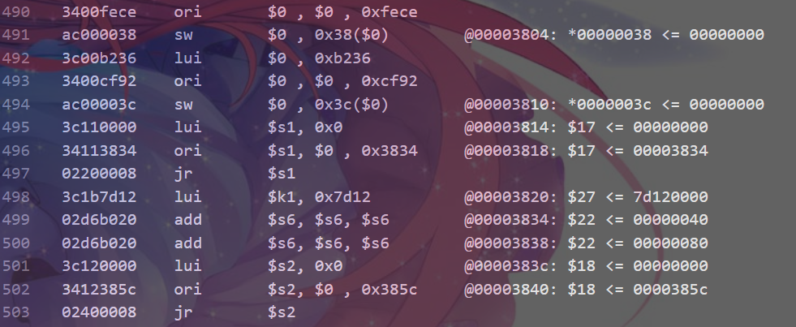
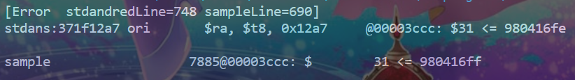
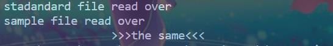

# 流水线 CPU 自动化测试工具

本套自动化测试工具主要包括三个部分

* 指令数据生成器 `CodeMaker.py`(只写了计算类)
* MIPS CPU 模拟器 `Mips.py`
* 对拍工具 `Diff.py`

## 食用

`CodeMaker.py`在stdout快速产生一串高质量机器码(曹哥哥yyds)

```cmd
<!-- cwd=.../localtools -->
python CodeMaker/CodeMaker.py
```

限制：不详
结果：


`MIPS.py`通过命令行读入机器码文件，最大步数可选，用来防死循环，在stdout输出 机器码，反汇编结果和模拟结果
`ExCute.py`实时运行，支持机器码和反汇编混用，不支持label和向后跳转，stdin读入，stdout输出
`DisAssembler.py`将机器码反汇编，stdin读入，stdout输出

```cmd
<!-- cwd=.../localtools -->
python MIPS/Simulator.py [maxPathNum]

<!-- 华丽的分割线 -->
<!-- MIPS下两个工具，ExCute.py和DisAssembler.py -->
python MIPS/ExCute.py
python MIPS/DisAssembler.py
```

规格：[见文档](https://github.com/Chlience/BUAA-CO/tree/MIPS_Simulator/localtools/MIPS)
结果



`Diff.py`从命令行读入两个文件进行比较，注意顺序是`MIPS.py`模拟输出在前，待check文件在后

```cmd
<!-- cwd=.../localtools -->
python Diff.py stdfile checkfile
```

结果



## 自动化

~~以下部分夹带vcs私货~~
windows和linux终端都有文件重定义，可以通过这个解决一波复制黏贴
~~当心windows powershell 默认UTF_16~~

对于非vcs链，我还不知道能不能重定向输出到文件
可以按以下步骤

```cmd
<!-- cwd=.../localtools -->
<!-- 当前cmd/ps在localtools -->
python CodeMaker(arong)/CodeMaker.py > MIPS/code.txt
<!-- 对于PS player记得打双引号和指定重定向输出编码 -->
python MIPS/Simulator.py MIPS/code.txt > Diff/stdand.txt

```

然后使用ise仿真获得输出粘到`Diff/check.txt`

```cmd
<!-- cwd=.../localtools -->
<!-- 当前cmd/ps在localtools -->
python Diff/Diff.py Diff/stdand.txt Diff/check.txt
```

对于vcs链，只需要交粘贴那一步用命令行重定向simv文件输出就好

```fish
./simv +vcs+finish+500us +fsdbfile+wave.fsdb > %PREFIXPATH%/localtools/Diff/check.txt
```

Diff会忽略版权信息
tips:vscode ctrl+g快捷键能快速定行

感谢曹哥哥的大力支持~~~请多多关注我家哥哥~~~

## 差错后debug

同任意编辑器打开Diff下stdand.txt和Diff下check.txt，用报错行数定位
通过上下文分析冲突和指令错误